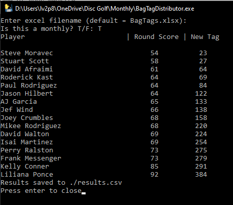

# Monthly Bag Tag

Thank you, intrepid tournament director, for your service in volunteering to run the club's Monthly Bag Tag tournament. The monthly bag tag is a chance for members of the club to come together and play a casually competitive event and try to win the lowest tag in the field that day and maybe a bit of cash on the side. Bag Tag rounds are a great introduction into competitive disc golfing for a couple of reasons:

- Low cost of entry
- Cards set by similar previous tag number (theoretically skill level)
- The layouts are typically a mellower assortment of challenging and easier holes vs. a major tournament layout

## Files

This directory contains 3 files of note to you, the TD:

- This README.md/pdf (same file different formats)
- The Excel sheet BagTags.xlsx
- An executable script BagTagDistributor.exe

In addition to the the documents in this directory you will also need a laptop computer, an internet connection and UDisc. As internet and power are not available on course, you will need to make sure your laptop is charged and hot spot your phone for wifi. You will also be issued a cash box with a bit of money in it for change, typically $40 in the form of $20 in 1's and $20 in 5's. At the conclusion of the event, please get the cash box back to David before Thursday following the monthly so it can be used for Weekly Doubles.

### README.md

This document details out the process for running a Bagtag tournament. If I seemed to have left anything out do not hesitate to reach out to me by FB Messenger, text, or phone (831-588-5385). I hope that this document is comprehensive and easily digestible, but I am human and I may overlook something.

### BagTags.xlsx

This is the sheet that tracks the participants for each week, the tag that they brought in that month, the amount of the payouts for each division as well as the total pot in play across all divisions. To the right side is a section for copy pasting the results from UDisc at the conclusion of the event. Prior to an event, I (David Ralston) will create the current weeks sheet for you and it will be the first sheet from the left within the Excel file. It is _important_ that the current week be the first sheet in the workbook for the purposes of the automation of distributing tags at the conclusion of the round.

When a player checks in, you will want to record their name, their selected division, more on divisions later, and their current tag number. It is paramount that you record the previous tag number accurately. They are used for deciding ties as well as defining the tags that are available to distribute later. DOUBLE CHECK THE TAG NUMBER!

The `Round_Score` and `New_Tag` columns are automatically filled in for you at the end of the round, once you paste in the results to the table at the right. If you notice that the value in that column is still `#N/A` after the UDisc results are entered, that means there is a name discrepancy between how someone checked in and their name in the UDisc app. First use best effort to resolve the discrepancy by copy pasting the registered name into the corresponding `UDisc_Name`. This will correct the issue. If you cannot figure out the discrepancy, simply call out to the participants to determine which name goes with which result.

### BagTagDistributor.exe

This directory should be downloaded onto your local machine. The automation script will not work within the online OneDrive application.

The UDisc event manager for the Monthly Bag Tag is here: <https://udisc.com/leagues/svdgc-2023-monthly/manage>. Once the round has completed, you will finalize the results on UDisc. This will cause an `Export to CSV` link to appear on the scoring tab of the even manager. You will click this link, open the downloaded file, copy the name and total score columns (Only) and paste those into the Excel file. Resolve any name discrepancies then save and close the Excel sheet.

Double Click the BagTagDistributor.exe and a console window will open with a prompt. I have set the default filename to the file that we currently use for tracking the Bag Tag results so you can simply press `enter`.

At the next prompt, type `T` and press enter. This step tells the script how to set the available tags for distribution.

The script will run and spit out the results to the console. It will also create a csv file within the directory containing the results it is displaying. Note the example from a previous bag tag round.

### Selling New Memberships

Players may purchase a calendar year membership at the bag tag event. David will supply you with tags to sell. Payments may be taken via Paypal, Cash or Check:

- Checks made Payable to Silicon Valley Disc Golf Club
- Paypal address: <payments@SVDGC.org>

When you sell membership please collect `Name`, `Email`, `Shipping Address` and `Payment Method` on the BagTags.xslx spreadsheet in the appropriate tab. David will go through following the monthly and add the new members to our current membership list and clear the data from this tab.
